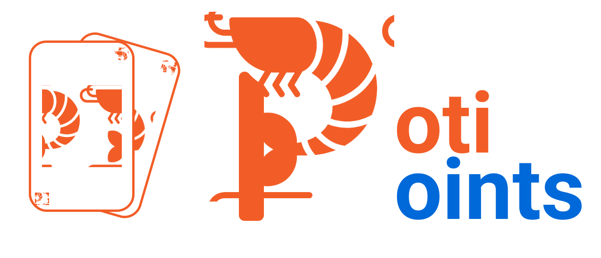
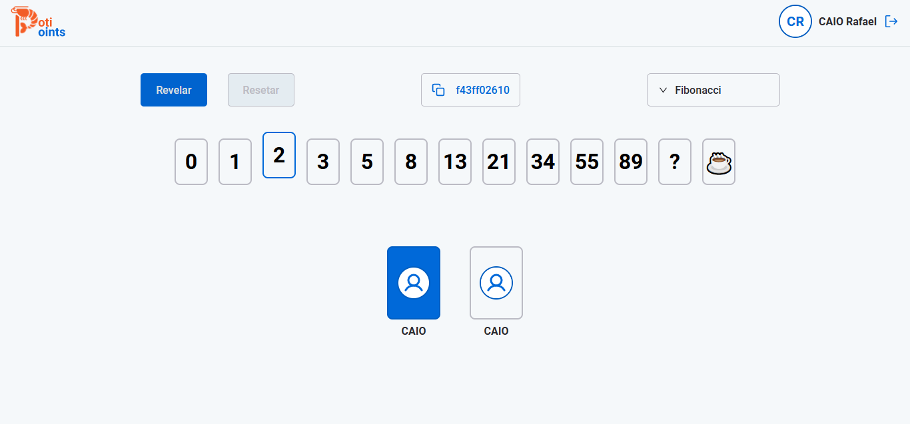

 

<h3 align="center">
    A new option for planning poker
</h3>

## About 

 

 

 

    it's a new option of planning poker for you team. created with the intention of facilitating the planning of your activities in teams.

 

## ⛏️ Built Using 

- [TypeScript](https://www.typescriptlang.org/) - Programming Language
- [ReactJs](https://pt-br.reactjs.org/) - Web Framework
- [Vite](https://vitejs.dev/) - Frontend Tooling
- [Styled-components](https://styled-components.com/) - Styling lib
- [Firebase](https://firebase.google.com/) - OAuth and database 
